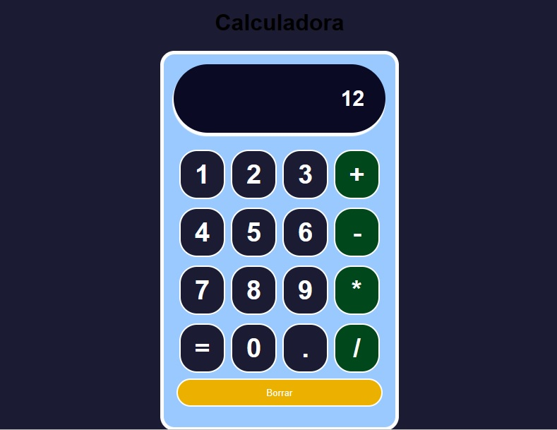

# Calculadora con React y CSS

Este es un proyecto de una calculadora implementada con React y CSS, diseñada para ser llamativa y funcional. Permite realizar operaciones matemáticas básicas como suma, resta, multiplicación y división.

## Tecnologías utilizadas

- React: una biblioteca de JavaScript para construir interfaces de usuario interactivas.
- CSS: lenguaje de estilo utilizado para dar formato y personalizar la apariencia del proyecto.
